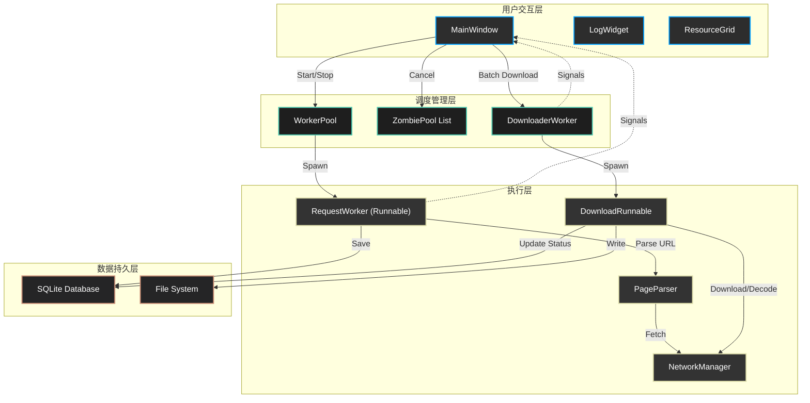

# 🕷️ Crawler

<div align="center">


[功能特性](#-核心功能) | [系统架构](#-系统架构) | [快速开始](#-快速开始) | [常见问题](#-快速解决方案--常见问题)

</div>

---

## 📖 简介 (Introduction)

**Crawler** 是一款专为**高稳定性**和**高性能**设计的桌面端网页资源提取工具。它不仅仅是一个简单的下载器，更是一个集成了智能解析、自动化并发控制和健壮错误处理的工业级系统。

v2.1 版本引入了 **"Zombie Pool" (僵尸池)** 线程管理机制和 **Data URI** 原生支持，彻底解决了高频操作下的崩溃问题，并实现了对内嵌 Base64 资源的完美提取。

## 🌟 核心功能

- **🚀 动态并发引擎**: 内置自适应 `WorkerPool`，根据任务队列深度自动调整线程数量 (1-20)，在速度与系统负载之间取得完美平衡。
- **🛡️ 工业级稳定性**:
  - **Zombie Pool 机制**: 彻底根除 "Use-after-free" 崩溃。并在重启任务时，安全地将旧线程池移入后台 ("僵尸状态") 等待其优雅退出。
  - **信号安全**: 全面的 Defensive Programming 设计，确保在极端 UI 销毁场景下后台线程也能安全着陆。
- **🧠 智能解析核心**:
  - **Data URI 支持**: 自动识别并解码 `data:image/...` 等 Base64 资源，无需网络请求直接保存。
  - **M3U8 流媒体**: 原生支持 HLS 协议，自动下载分片并调用 FFmpeg 合并为 MP4。
- **🎨 现代化 UI**:
  - **实时监控**: 状态栏实时显示 CPU 和内存占用，健康状态一目了然。
  - **网格视图**: 专为图片资源设计的 Grid View，支持懒加载预览。

## �️ 系统架构

Crawler 采用 **事件驱动 (Event-Driven)**的架构设计，确保 UI 线程永远流畅。



### 关键流程说明
1.  **任务调度**: `WorkerPool` 负责分发任务。当用户点击 "停止" 或 "重新开始" 时，旧的 Pool 会被原子性地移入 `ZombiePool List`，确保不会立即销毁导致 C++ 对象悬空 (Dangling Pointer)。
2.  **数据流转**: 所有解析结果首先存入 SQLite (WAL 模式)，UI 通过信号 (Signals) 异步获取更新，保证界面始终响应。

## ⚡ 快速开始

### 环境要求
- Python 3.10+
- FFmpeg (用于视频合并，请添加到 PATH)

### 安装步骤

1.  **克隆代码仓库**
    ```bash
    git clone https://github.com/Xustalis/Crawler.git
    cd Crawler
    ```

2.  **安装依赖**
    ```bash
    pip install -r requirements.txt
    ```

3.  **运行应用**
    ```bash
    python app.py
    ```

## 🛠️ 快速解决方案 & 常见问题

### Q1: 遇到 `AttributeError` 或 `RuntimeError: wrapped C/C++ object has been deleted` 崩溃?
**A: 已修复。** 
这是由于后台线程在 UI 组件销毁后仍尝试发送信号导致的。
*   **解决方案**: 请更新到 **v2.1.0+**。我们引入了 **Zombie Pool** 机制和信号发射保护 (`try-except RuntimeError`)，即使在极快速度下点击 "开始/停止" 也不会崩溃。

### Q2: 自带的 "Data URI" 图片下载失败?
**A: 已修复。**
旧版本将 `data:image/png;base64,...` 误认为网络 URL 进行 HTTP 请求。
*   **解决方案**: 新版本会自动识别 `data:` 协议，直接在本地解码 Base64 并保存文件，无需网络连接。

### Q3: 视频下载只有音频或画面?
**A: 检查 FFmpeg。**
M3U8 下载完成后需要 FFmpeg 进行合并。
*   **检查**: 在终端输入 `ffmpeg -version`。如果未找到命令，请安装 FFmpeg 并将其 `bin` 目录添加到系统环境变量 `PATH` 中。

## 🤝 贡献 (Contributing)

欢迎提交 Issue 和 Pull Request！

1.  Fork 本仓库
2.  创建特性分支 (`git checkout -b feature/NewFeature`)
3.  提交更改 (`git commit -m 'feat: Add NewFeature'`)
4.  推送到分支 (`git push origin feature/NewFeature`)
5.  提交 Pull Request

## 📜 许可证

本项目基于 **GPL v3** 许可证开源。
